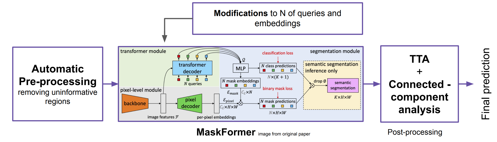

# MaskFormer for Polyps Segmentation
Mask Classification-based method for Polyps Segmentation and Detection, [EndoCV 2022 challenge](https://endocv2022.grand-challenge.org/).
Authors: [Mariia Kokshaikyna](https://github.com/MariaKokshaikina), [Yurii Yelisieiev](https://github.com/YuraYelisieiev), and [Mariia Dobko](https://github.com/marichka-dobko).

We introduce a mask classification model with a transformer decoder for polyps segmentation in endoscopy images. 
Our novel approach combines custom data pre-processing, a modified mask classification network, 
test time augmentations, and connected-component analysis. We show the successful performance for polyp semantic 
segmentation and detection tasks in EndoCV 2022 challenge. 

The paper about our solution will be published in proceedings of EndoCV Challenge. 

This implementation is based on original [MaskFormer](https://github.com/facebookresearch/MaskFormer).
We modify some of its components to use it for EndoCV challenge.

Our pipeline is shown below:

  

## Our research contribution
1. Evaluated and showed the performance of mask classification method - MaskFormer on endoscopy data. Added custom modifications that improve results of MaskFormer for polyp segmentation.
2. Presented a step-by-step pre-processing mechanism for training and inference
3. Tested the impact of different loss functions
4. Added custom post-processing using test time augmentations and connected-component analysis

## Data
EndoCV challenge aims to tackle the generalizability aspect of such methods. 
In 2022, it has two sub-challenges (Endoscopy artefact detection) EAD 2.0 and (Polyp generalization) PolypGen 2.0. Both tracks set detection and segmentation tasks on a diverse population dataset.

The data can be accessed only by the challenge participants and with the signature of Data Rules form.
To find out more about dataset, please refer to the [challenge page](https://endocv2022.grand-challenge.org/Data/).

We also experimented with [HyperKvasir](https://osf.io/mh9sj/) open source dataset, so dataloaders and preprocessing is also available for this data.

## Requirements 
From MaskFormer repo:

- Linux or macOS with Python ≥ 3.6
- PyTorch ≥ 1.7 and [torchvision](https://github.com/pytorch/vision/) that matches the PyTorch installation.
  Install them together at [pytorch.org](https://pytorch.org) to make sure of this. Note, please check
  PyTorch version matches that is required by Detectron2.
- Detectron2: follow [Detectron2 installation instructions](https://detectron2.readthedocs.io/tutorials/install.html).
- OpenCV is optional but needed by demo and visualization
- `pip install -r requirements.txt`

## Tutorials about MaskFormer
If you're unfamiliar with the MaskFormer framework, you can use official documentation and tutorials:

* [Preparing Datasets for MaskFormer](https://github.com/facebookresearch/MaskFormer/tree/main/datasets/README.md)

* [Getting Started with MaskFormer](https://github.com/facebookresearch/MaskFormer/tree/main/GETTING_STARTED.md)

## License

Some parts of this repository is available under MIT license, mainly all of our contributions are open-source.

However, since our code is heavily dependent on the original MaskFormer implementation, the parts from that repo are 
licensed under a [Creative Commons Attribution-NonCommercial 4.0 International License](LICENSE).

Shield: [![CC BY-NC 4.0][cc-by-nc-shield]][cc-by-nc]

[![CC BY-NC 4.0][cc-by-nc-image]][cc-by-nc]

[cc-by-nc]: http://creativecommons.org/licenses/by-nc/4.0/
[cc-by-nc-image]: https://licensebuttons.net/l/by-nc/4.0/88x31.png
[cc-by-nc-shield]: https://img.shields.io/badge/License-CC%20BY--NC%204.0-lightgrey.svg

